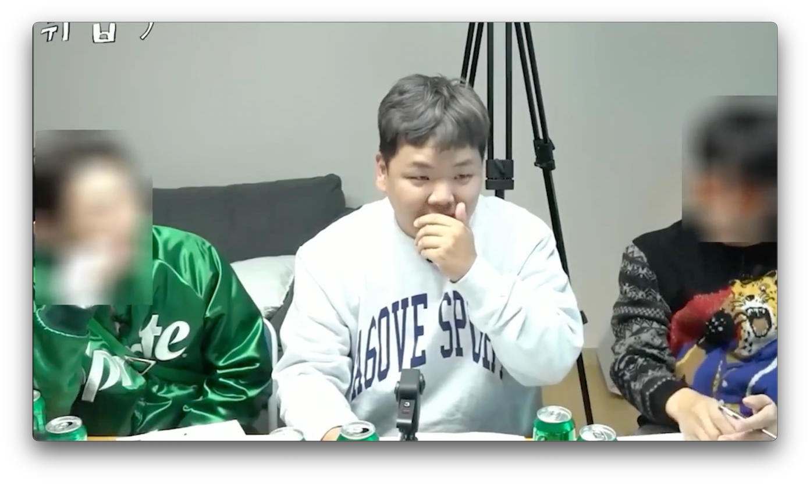
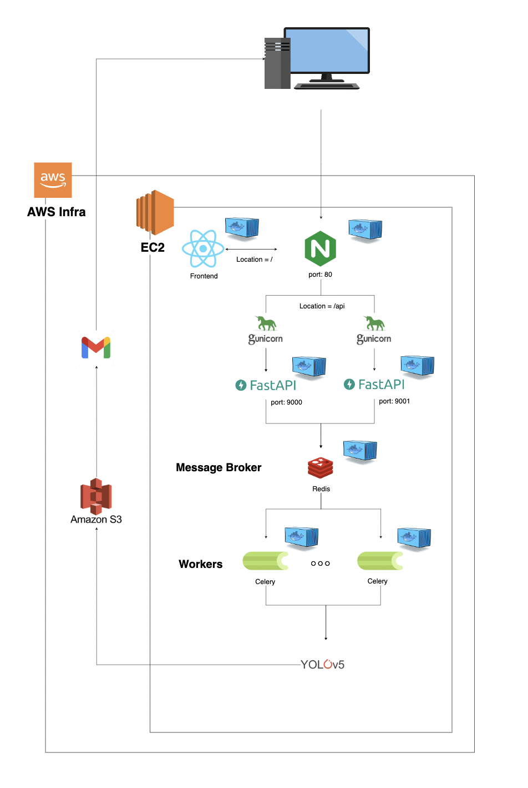
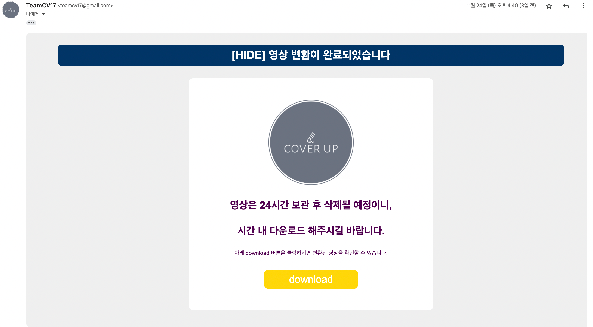
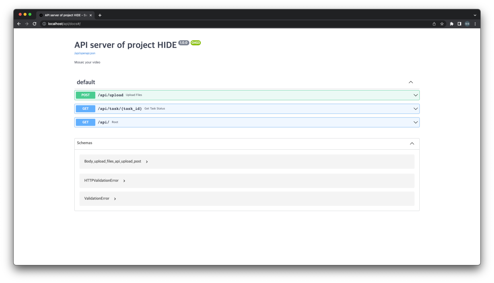

# Server
Backend of [project HIDE](http://54.180.220.9)

### 특정 인물 모자이크


### 특정 인물 제외 모자이크



---
## How to run
To run this, you need docker image of [frontend](https://github.com/seoheolim/Frontend)

### Build frontend docker image
```sh
git clone https://github.com/seoheolim/Frontend.git

# build docker frontend image
cd Frontend/reactapp
docker build -t front .
```
Set your .env file.

---
### Run 
```sh
docker-compose up -d --build
```
The app will be running at http://localhost

---
## Architecture


---
## 주요 이슈
### 1. 비동기 처리를 위한 아키텍처

처리해야 하는 문제(영상 변환)는 영상의 길이에 따라 변환 시간이 상이하고, 긴 시간이 소요되는 작업입니다.  30초 영상 → 5~10분
이러한 작업을 동기적으로 처리하게 되면, 그 시간 동안 사용자는 기다려야 하기 때문에 이런 문제를 해결하기 위해 `Celery`를 사용하였습니다.
Message Broker로 Redis를 사용하였고, Celery를 사용한 비동기 아키텍처를 구현하였습니다.
동기로 처리해야 하는 로직과 비동기로 처리할 수 있는 로직을 분리하였습니다.

### 2. 음성 데이터 복구

영상 변환 과정 중, 영상의 음원이 손실되는 문제가 발생했습니다.
이런 문제를 해결하기 위해, 영상을 변환하기 전, 영상에서 음원을 추출한 후, 처리가 완료된 영상과 추출한 음원을 합치는 로직을 통해 음성 데이터를 복원할 수 있었습니다.
Moviepy와 ffmpeg 라이브러리를 활용하였습니다.

### 3. 결과 전송
메일로 결과물을 전송할 수 있는 용량의 한계가 존재했기 때문에, 이러한 문제점을 해결하기 위한 방법으로 영상에 접근할 수 있는 경로를 제공하는 방법을 제안하였습니다. 

Amazon S3를 사용하여, 변환이 완료된 영상을 저장한 후, 이에 접근할 수 있는 경로를 메일로 제공하는 방법으로 구현하였습니다.

변환된 영상은 일정 시간이 지나면, 자동으로 삭제될 수 있게 백그라운드로 스케줄러가 실행되게끔 구현하였습니다. 
Redis에 log를 저장하여, 해당 log를 참고하여 매일 자정에 기간이 지난 영상들을 삭제될 수 있도록 S3와 연결하는 삭제 로직을 구현하였습니다.

#### 실제 이메일 전송 화면


### 4. 인프라 구축
Nginx를 리버스 프록시로 설정하여, 로드 밸런싱을 적용하였습니다. 

AWS EC2 인스턴스를 생성하여, Nginx, React, Redis, Celery, FastAPI 인스턴스를 Docker container화 하였고, 모든 컨테이너를 docker-compose로 관리하게 쉽게 구현하였습니다. 

또한 FastAPI상에서 지원하는 Uvicorn은 단일 프로세스로 비동기 처리가 가능하지만, 결국 단일 프로세스라는 한계가 있습니다.

처리량을 더 늘리기 위해서 멀티 프로세스를 활용하는 Gunicorn을 사용하였습니다. 

---

## Swagger
You can test your app on http://localhost/api/docs

